# 系统设计文档

> 项目名称：**轻量 WebDAV 同步下载工具（Android）**
> 文档版本：v1.0 · 最后更新：2026-08-05
> 依据：本文档基于 `app/src/main/` 实际代码与 `app/build.gradle.kts`、`AndroidManifest.xml` 推导。`✅` 表示已实现，`📌` 表示待扩展。

---

## 1. 技术选型

### 1.1 总体技术栈

| 层次 | 技术 | 版本（来自 `app/build.gradle.kts`） | 选型理由 |
|------|------|--------------------------------------|----------|
| 语言 | Kotlin | 2.0.20 | Android 官方首选语言；协程/Flow 原生支持 |
| 构建 | Gradle (Kotlin DSL) + AGP | AGP 8.6.1 | `build.gradle.kts` 单模块 `:app` |
| UI | Jetpack Compose + Material 3 | Compose BOM 2024.09.02 | 声明式 UI，适配墨水屏灰阶主题 |
| 导航 | Navigation Compose | 2.8.0 | 单 Activity 多 Composable 路由 |
| ViewModel | lifecycle-viewmodel-compose | 2.8.6 | 配置变更时保留状态 |
| 数据库 | Room | 2.6.1（KSP 2.0.20-1.0.25） | 轻量本地关系型存储，编译期 SQL 校验 |
| 网络 | OkHttp | 4.12.0 | 自研 WebDAV 客户端的 HTTP 基础 |
| 本地文件 | SAF + DocumentFile | documentfile 1.1.0 | 兼容 Scoped Storage 的目录授权访问 |
| 凭证加密 | EncryptedSharedPreferences | security-crypto 1.1.0-alpha06 | 密码 AES-GCM 256 加密落盘 |
| 并发 | Kotlin Coroutines + Flow | 随 Kotlin 标准库 | IO 协程 + StateFlow 进度推送 |
| DI | 手动 `AppContainer` | 无 Hilt | 保持轻量与快速构建（见 `di/AppContainer.kt`） |
| 测试 | JUnit4 + MockWebServer + kxml2 | 4.13.2 / 4.12.0 / 2.3.0 | PROPFIND 解析单测 + 真实服务器 E2E |

### 1.2 关键设计决策

| 决策 | 选择 | 理由 |
|------|------|------|
| WebDAV 客户端 | **自研**（不引第三方库如 sardine-android） | 需求仅 PROPFIND + GET，自研可控、体积小、便于适配 AList 的多 propstat 怪异行为 |
| 同步方向 | **单向下载** | 避免双向同步的冲突复杂度，定位为"拉取工具" |
| 默认同步策略 | **只增不删**（`overwrite=false`） | 防止误删本地文件，尊重用户已有数据 |
| 触发方式 | **手动触发**（无定时/后台轮询） | 省电、需求最小化；`RECEIVE_BOOT_COMPLETED` 权限预留但未实现 |
| 依赖注入 | **手动容器**（非 Hilt） | 类少、关系简单，避免 Hilt KAPT/KSP 增量构建开销 `[待确认]`：若后续类增多可迁移 Hilt |
| UI 主题 | **电子墨水屏灰阶** | 项目目标设备含墨水屏阅读器，彩色在墨水屏上不可读 |
| 增量判定 | **ETag 优先，size+lastModified 兜底** | ETag 最可靠；部分服务器不返回 ETag 时退化兜底 |
| 错误隔离 | **单文件失败不中断整体** | 提升大批量同步的成功率，失败项下次续传 |

### 1.3 SDK 与权限配置

来自 `AndroidManifest.xml`：

| 权限 | 用途 | 状态 |
|------|------|------|
| `INTERNET` | WebDAV 网络访问 | ✅ |
| `ACCESS_NETWORK_STATE` | 检查在线/Wi-Fi 状态 | ✅ |
| `FOREGROUND_SERVICE` | 前台同步服务 | ✅ |
| `FOREGROUND_SERVICE_DATA_SYNC` | Android 14+ 前台服务类型声明 | ✅ |
| `POST_NOTIFICATIONS` | Android 13+ 通知权限（运行时申请） | ✅ |
| `RECEIVE_BOOT_COMPLETED` | 预留开机自启（未实现接收器） | 📌 |

SDK 版本：`minSdk=29`（Android 10）/ `targetSdk=compileSdk=35`。

---

## 2. 系统架构

### 2.1 分层架构图

项目采用清晰的**分层 + 单向依赖**架构，遵循 Android 推荐的 UI / Domain / Data 分层。

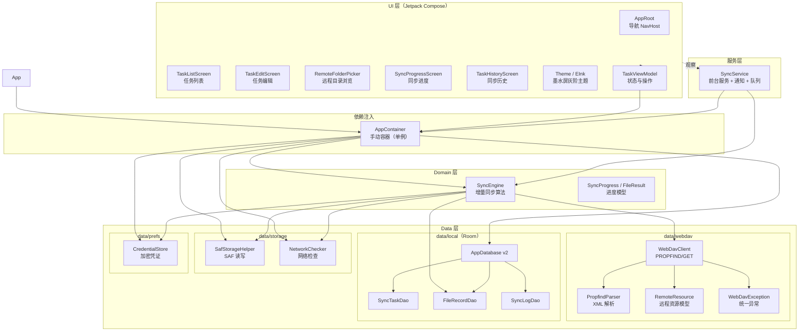

### 2.2 模块依赖关系

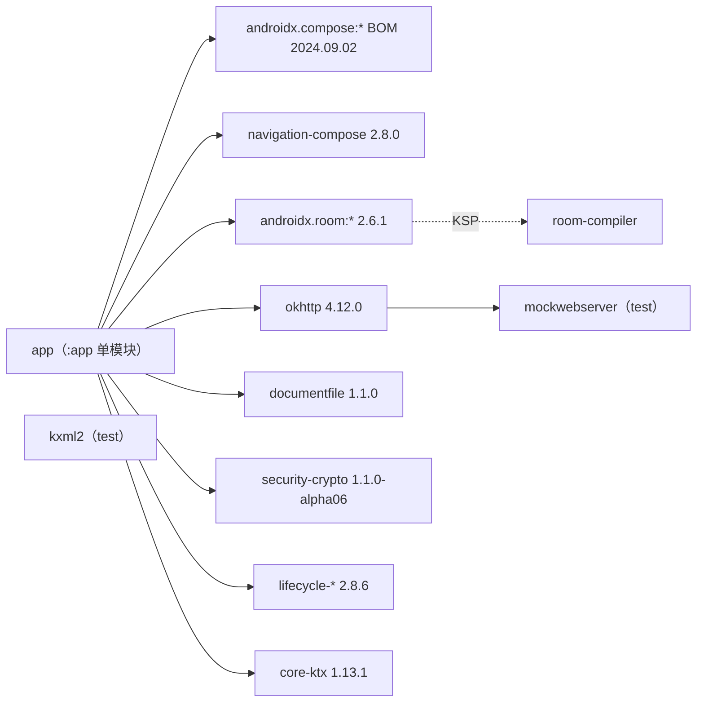

---

## 3. 数据模型（ER 图 / Schema）

### 3.1 实体关系图

Room 数据库 `webdav_sync.db`（version 2），含 3 张实体表 + 1 个加密 Prefs 文件。

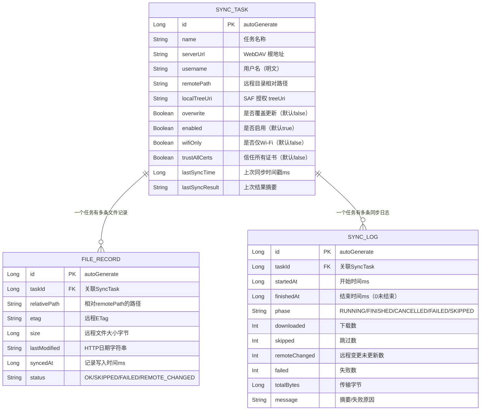

### 3.2 唯一约束与索引

| 表 | 约束 | 定义位置 |
|----|------|----------|
| `file_records` | 唯一索引 `(taskId, relativePath)` | `@Index(value = ["taskId","relativePath"], unique = true)` |
| `sync_logs` | 普通索引 `taskId` | `@Index(value = ["taskId"])` |

### 3.3 凭证存储（独立于 Room）

```text
EncryptedSharedPreferences 文件: webdav_credentials
  ├─ 加密方案: MasterKey AES256-GCM + PrefKey AES256-SIV + PrefValue AES256-GCM
  └─ 键值: task_{id}_password → 密码明文（加密存储）
```

### 3.4 数据库迁移

`AppDatabase.MIGRATION_1_2`（`data/local/AppDatabase.kt:33`）：

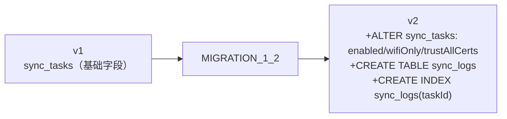

> 说明：`exportSchema = false`，未导出 JSON Schema 文件 `[待确认]`：是否需要开启 schema 导出用于正式版本管理。

---

## 4. 核心流程图

### 4.1 同步引擎主流程（SyncEngine.sync）

`domain/SyncEngine.kt:51` 实现的完整同步算法：

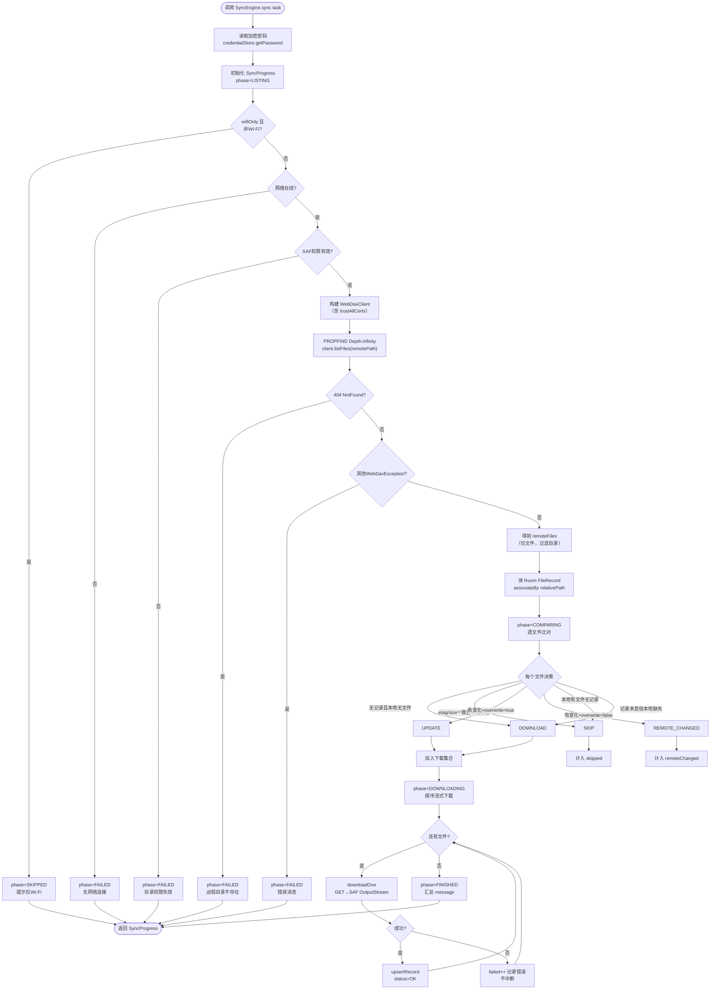

### 4.2 前台服务任务调度（SyncService）

`service/SyncService.kt` 的队列消费与生命周期：

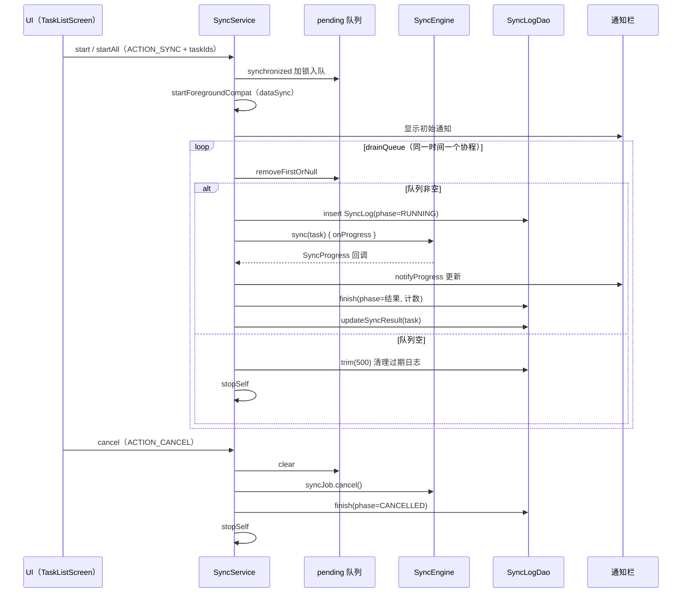

### 4.3 PROPFIND 解析流程（PropfindParser）

`data/webdav/PropfindParser.kt` 的 XML 解析状态机：

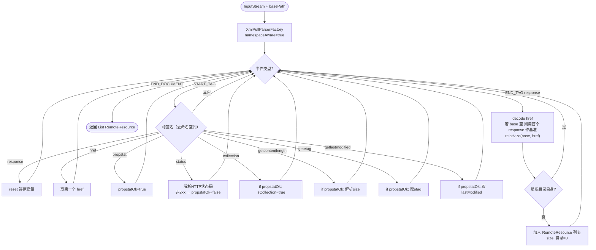

### 4.4 任务编辑与保存流程

`ui/task/TaskEditScreen.kt` + `TaskViewModel.saveTask`：

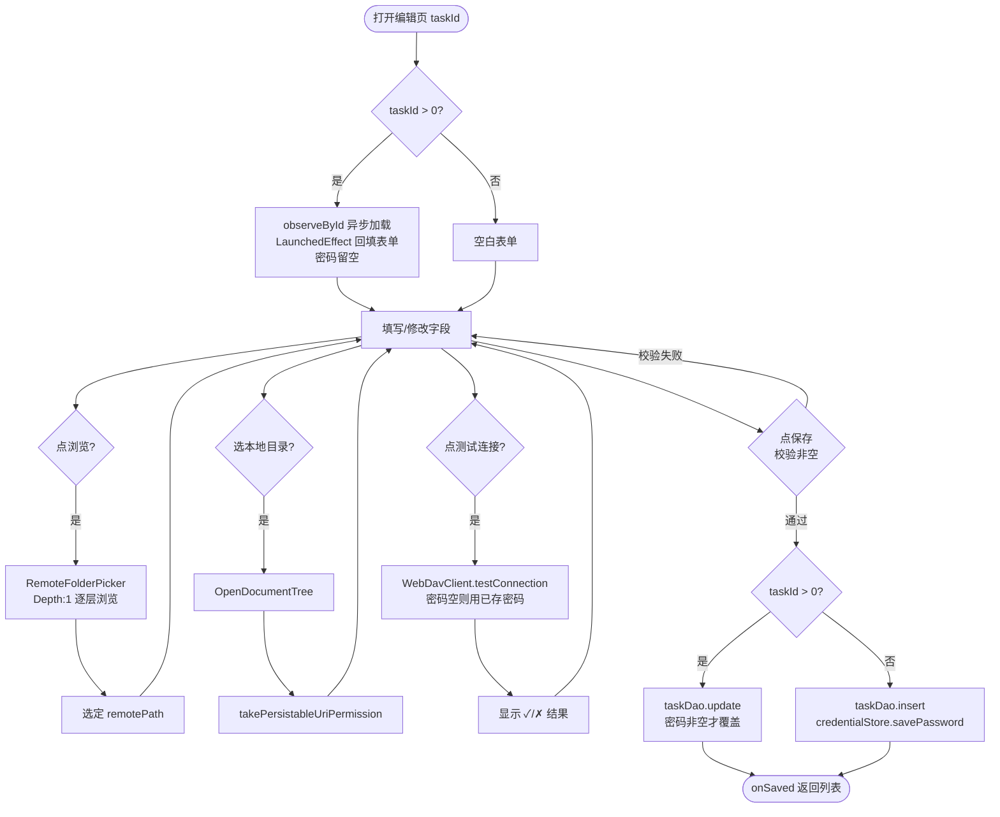

---

## 5. WebDAV 客户端设计

`data/webdav/WebDavClient.kt` 基于 OkHttp，仅实现 PROPFIND + GET + testConnection。

### 5.1 方法清单

| 方法 | HTTP 方法 | Depth | 用途 | 状态 |
|------|-----------|-------|------|------|
| `listFiles(remotePath)` | PROPFIND | infinity | 递归拉取全部文件（过滤目录） | ✅ |
| `listDirectory(remotePath)` | PROPFIND | 1 | 单层列举直接子项（目录浏览器用） | ✅ |
| `download(remotePath, fromByte, consumer)` | GET | — | 流式下载，支持 Range | ✅ |
| `testConnection(remotePath)` | PROPFIND | 0 | 探测连接与认证 | ✅ |

### 5.2 PROPFIND 请求体

固定请求以下 4 个属性（`WebDavClient.kt:187`）：

```xml
<D:propfind xmlns:D="DAV:">
  <D:prop>
    <D:resourcetype/>
    <D:getcontentlength/>
    <D:getetag/>
    <D:getlastmodified/>
  </D:prop>
</D:propfind>
```

### 5.3 异常分类（WebDavException）

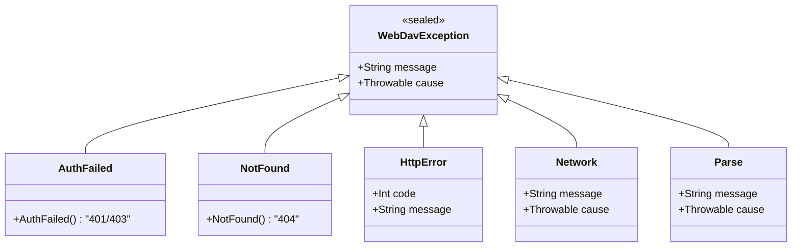

### 5.4 异常处理映射

| HTTP 状态 | 异常类型 | 处理 |
|-----------|----------|------|
| 200-299 / 206 | 正常 | 返回响应 |
| 401 / 403 | `AuthFailed` | 同步失败提示"认证失败" |
| 404 | `NotFound` | 远程目录不存在提示 |
| 其他非 2xx | `HttpError` | 透传 HTTP 码 |
| IO 异常 | `Network` | "网络请求失败" |
| XML 解析失败 | `Parse` | "解析 PROPFIND 响应失败" |

---

## 6. SAF 本地存储设计

`data/storage/SafStorageHelper.kt` 封装 DocumentFile 操作。

### 6.1 关键方法

| 方法 | 功能 | 状态 |
|------|------|------|
| `takePersistablePermission(treeUri)` | 持久化读写权限 | ✅ |
| `hasPermission(treeUri)` | 校验权限是否仍有效 | ✅ |
| `rootDir(treeUri)` | 获取根 DocumentFile | ✅ |
| `openOutputStream(treeUri, relativePath, append)` | 创建文件输出流，自动建子目录 | ✅ |
| `fileExists(treeUri, relativePath)` | 判断文件是否存在 | ✅ |
| `fileSize(treeUri, relativePath)` | 获取本地文件大小 | ✅ |

### 6.2 目录/文件创建逻辑

`writeAtomically`（下载写入的推荐路径）处理 `relativePath`（如 `sub/a.txt`）：

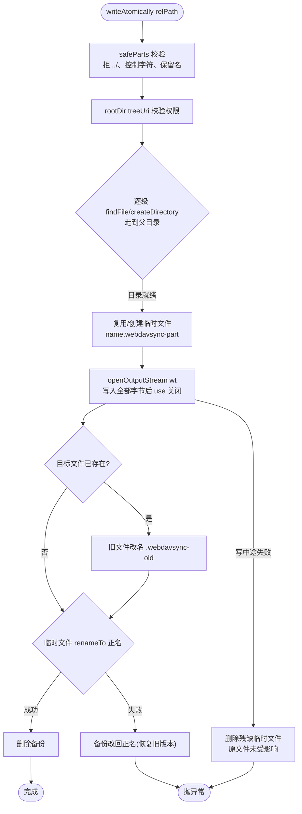

> 原子性说明：SAF 无跨文件原子 rename,这里以「临时文件 → 备份改名 → 正名替换」尽力逼近——
> 写入阶段失败原文件零影响;替换阶段失败自动恢复备份。`openOutputStream`（直接覆盖写,`wt`/`wa`）
> 仍保留供非下载场景使用。断点续传未启用（`SyncEngine` 固定 `fromByte=0L`）。

---

## 7. UI 架构与导航

### 7.1 导航图

`ui/AppRoot.kt` 定义 4 个路由，单 Activity（`MainActivity`）：

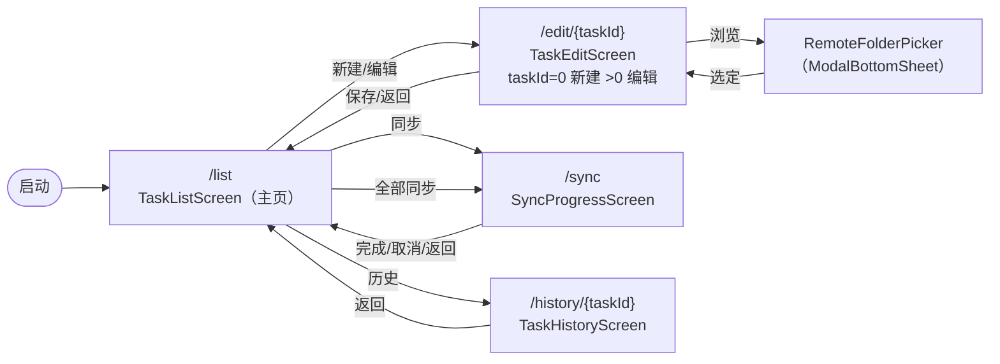

### 7.2 主题设计（墨水屏适配）

`ui/theme/Theme.kt` + `EInk.kt` 的设计原则：

| 原则 | 实现 |
|------|------|
| 纯灰阶 | 所有 Material colorScheme token 映射为黑/白/灰（`InkBlack`/`InkPaper`/`InkText`/`InkMuted` 等） |
| 强制浅色 | `darkTheme` 参数被忽略，一律 `lightColorScheme` |
| 描边代阴影 | `EInkCard` 使用 `BorderStroke 1dp` + `elevation=0dp` |
| 状态不依赖颜色 | 完成/失败用符号 `✓`/`✗`/`–` + 文字双重标识（见 `TaskHistoryScreen.phaseLabel`） |
| 状态栏透明 | `statusBarColor=Transparent`，浅底深色图标 |

---

## 8. 并发与状态管理

### 8.1 协程作用域

| 组件 | 作用域 | 调度器 | 用途 |
|------|--------|--------|------|
| `SyncService` | `CoroutineScope(SupervisorJob + Dispatchers.IO)` | IO | 同步队列消费 |
| `TaskViewModel` | `viewModelScope` | Main + IO（`withContext`） | 数据库操作/网络测试 |
| `SyncEngine.sync` | suspend（继承调用方） | IO | 同步主流程，支持 `ensureActive` 取消 |

### 8.2 进度推送

`SyncService` 通过单例 `StateFlow` 向 UI 推送实时进度，UI 用 `collectAsState` 观察：

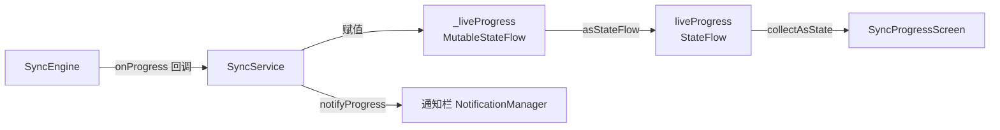

### 8.3 取消机制

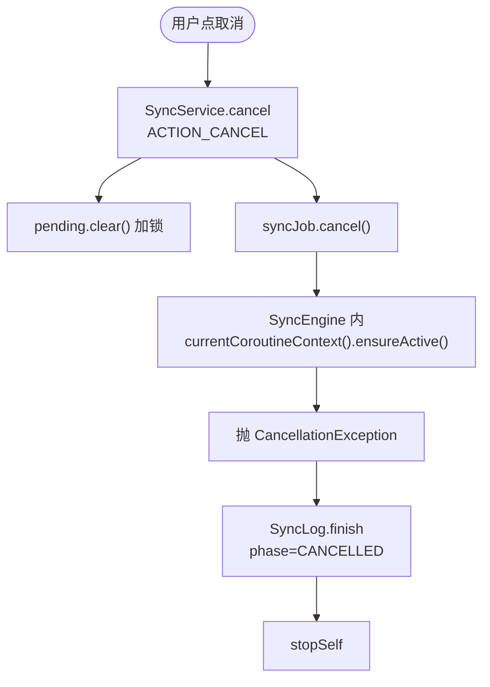

---

## 9. 安全设计

| 方面 | 措施 | 状态 |
|------|------|------|
| 密码存储 | EncryptedSharedPreferences（AES-GCM 256 + AES-SIV-CMAC256），解密失败自愈重建（换机恢复场景） | ✅ |
| 用户名/配置 | Room 明文（非敏感），不参与云备份/设备迁移 | ✅ |
| 凭证清理 | 任务删除时 `credentialStore.deletePassword` | ✅ |
| TLS | 默认系统证书校验；信任锚仅系统 CA（不含 user CA） | ✅ |
| 自签名支持 | 任务级 `trustAllCerts` 开关（含 UI 风险提示） | ✅ |
| 明文 HTTP | `network_security_config.xml` 允许 cleartextTraffic（适配内网），编辑页 `http://` 显示警示 | ✅ |
| 备份排除 | `backup_rules.xml`（API≤30）+ `data_extraction_rules.xml`（API 31+）排除凭证与数据库 | ✅ |
| 路径注入防护 | 远程相对路径经 `safeParts` 校验（拒 `..`/控制字符/保留名）后才写入 SAF | ✅ |
| SAF 权限 | `takePersistableUriPermission`，删除任务且无其他任务共用目录时释放 | ✅ |
| 网络 | 仅访问用户配置的 WebDAV 服务器，无其他上报 | ✅ |

> ⚠️ `trustAllCerts` 会降低安全性（信任任意证书 + 跳过主机名校验），UI 已明确提示"请勿用于公网未知服务器"。

---

## 10. 测试策略

| 层次 | 测试 | 文件 | 覆盖 | 状态 |
|------|------|------|------|------|
| 单元测试 | PROPFIND 解析 | `PropfindParserTest.kt` | 标准多文件、AList 多 propstat 中文路径、Depth:1 单层 | ✅ |
| 单元测试 | WebDavClient E2E | `WebDavClientE2ETest.kt` | 真实 AList 服务器 PROPFIND + GET（不可达自动 `assumeTrue` 跳过） | ✅ |
| Instrumented | 设备端全链路 | `DeviceSyncE2ETest.kt` | 真机 arm64 PROPFIND + GET + listDirectory | ✅ |

### 10.1 测试覆盖矩阵

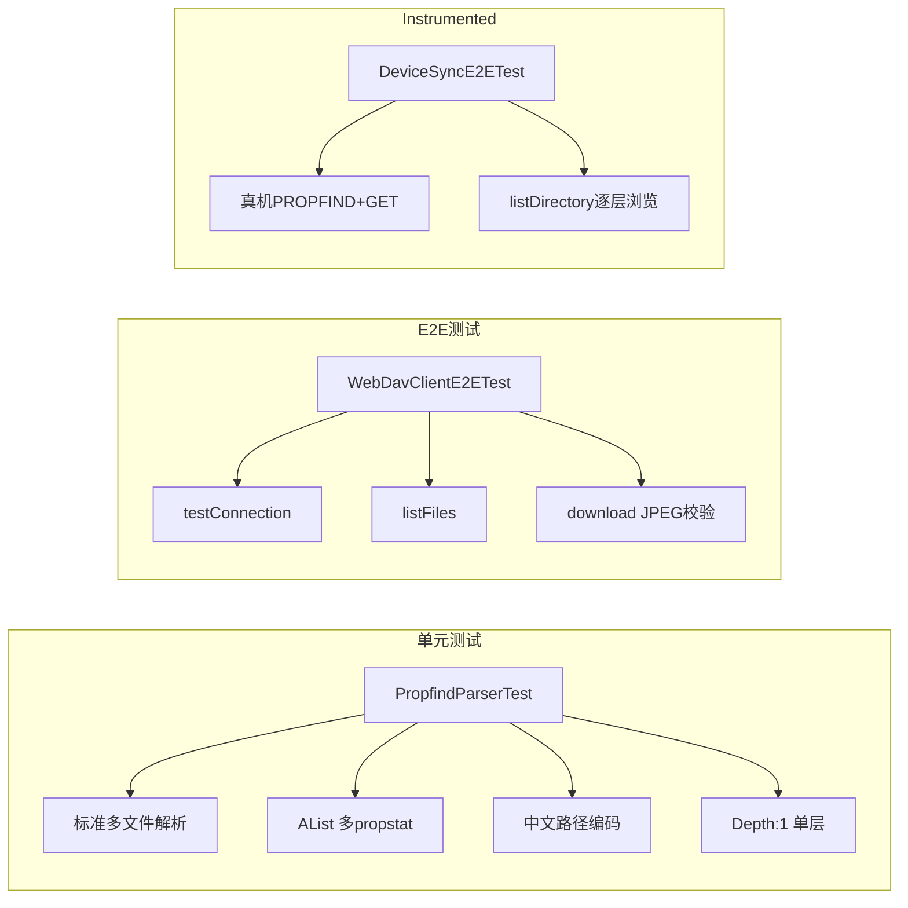

---

## 11. 已实现 vs 待扩展

### 11.1 已实现（✅）

- 单向 WebDAV → 本地 增量下载
- 多任务管理（增删改查、启用/停用）
- ETag 优先的增量比对
- 只增不删 / 可选覆盖更新
- 前台服务 + 通知 + 取消
- SAF 持久化目录授权
- 密码加密存储
- 远程目录浏览器
- 测试连接
- 同步历史记录
- 仅 Wi-Fi / 信任证书选项
- 墨水屏灰阶 UI
- Room 数据库迁移
- PROPFIND 解析单测 + 真实服务器 E2E

### 11.2 待扩展（📌）

| 编号 | 待扩展项 | 现状/依据 |
|------|----------|-----------|
| D-1 | 断点续传实际接通 | `WebDavClient.download(fromByte)` 支持 Range，`SyncEngine.downloadOne` 固定 `fromByte=0L` |
| D-2 | 定时同步 / 开机自启 | `RECEIVE_BOOT_COMPLETED` 权限已声明，无 BroadcastReceiver |
| D-3 | 上传 / 双向同步 | 当前仅单向下载 |
| D-4 | 国际化（i18n） | UI 文案硬编码中文，`strings.xml` 仅 app_name |
| D-5 | Hilt 依赖注入 | 当前手动 `AppContainer`，`[待确认]` 类增多后是否迁移 |
| D-6 | Room schema 导出 | `exportSchema = false` |
| D-7 | 完整无障碍审计 | Compose contentDescription 部分添加 `[待确认]` |
| D-8 | 双因素/Token 认证 | 仅 Basic 认证 |
| D-9 | 同步冲突解决 | 单向无冲突；若扩展双向需设计冲突策略 |
| D-10 | 后台保活白名单引导 | 未引导用户关闭电池优化 |

---

## 12. 参考文件索引

| 关注点 | 文件路径 |
|--------|----------|
| 应用入口 | `app/src/main/java/com/example/webdavsync/WebDavSyncApp.kt` |
| 唯一 Activity | `app/src/main/java/com/example/webdavsync/MainActivity.kt` |
| 导航 | `app/src/main/java/com/example/webdavsync/ui/AppRoot.kt` |
| 依赖容器 | `app/src/main/java/com/example/webdavsync/di/AppContainer.kt` |
| 同步引擎 | `app/src/main/java/com/example/webdavsync/domain/SyncEngine.kt` |
| 进度模型 | `app/src/main/java/com/example/webdavsync/domain/model/SyncProgress.kt` |
| WebDAV 客户端 | `app/src/main/java/com/example/webdavsync/data/webdav/WebDavClient.kt` |
| PROPFIND 解析 | `app/src/main/java/com/example/webdavsync/data/webdav/PropfindParser.kt` |
| 异常 | `app/src/main/java/com/example/webdavsync/data/webdav/WebDavException.kt` |
| 远程资源模型 | `app/src/main/java/com/example/webdavsync/data/webdav/RemoteResource.kt` |
| Room 数据库 | `app/src/main/java/com/example/webdavsync/data/local/AppDatabase.kt` |
| 任务实体 | `app/src/main/java/com/example/webdavsync/data/local/entity/SyncTask.kt` |
| 文件记录实体 | `app/src/main/java/com/example/webdavsync/data/local/entity/FileRecord.kt` |
| 同步日志实体 | `app/src/main/java/com/example/webdavsync/data/local/entity/SyncLog.kt` |
| SAF 存储 | `app/src/main/java/com/example/webdavsync/data/storage/SafStorageHelper.kt` |
| 网络检查 | `app/src/main/java/com/example/webdavsync/data/storage/NetworkChecker.kt` |
| 凭证加密 | `app/src/main/java/com/example/webdavsync/data/prefs/CredentialStore.kt` |
| 前台服务 | `app/src/main/java/com/example/webdavsync/service/SyncService.kt` |
| 任务 ViewModel | `app/src/main/java/com/example/webdavsync/ui/task/TaskViewModel.kt` |
