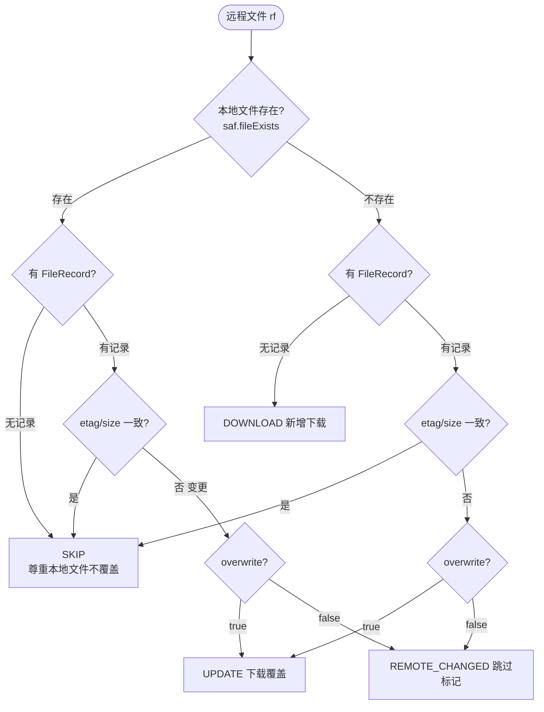
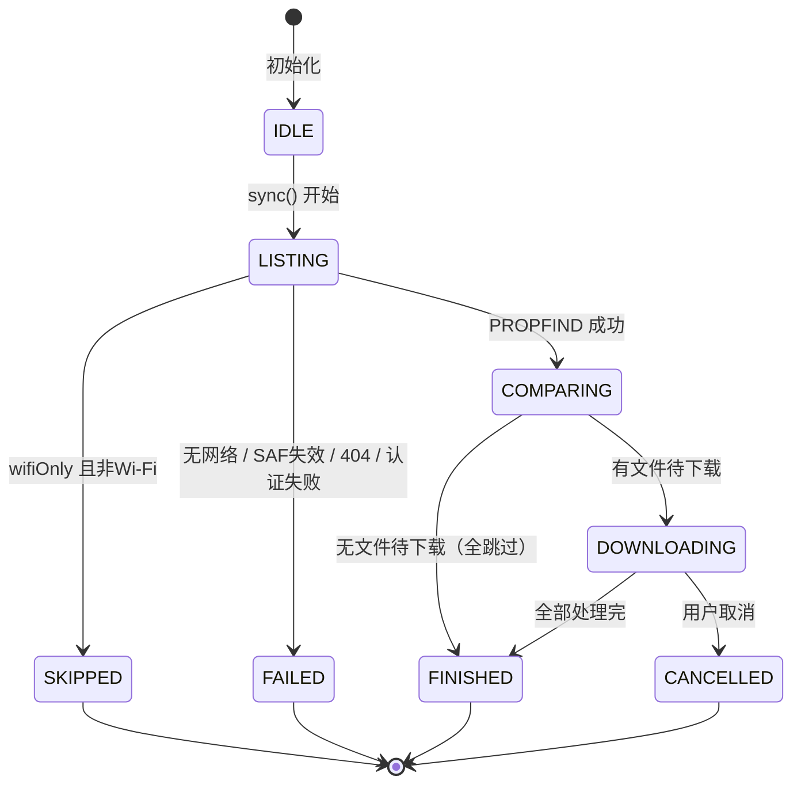
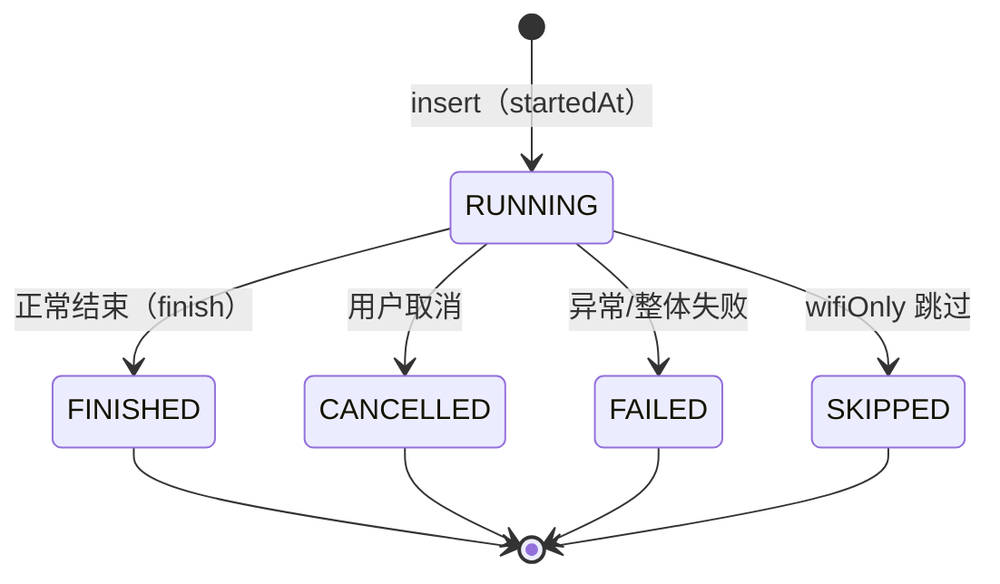

# 功能规格文档

> 项目名称：**轻量 WebDAV 同步下载工具（Android）**
> 文档版本：v1.0 · 最后更新：2026-08-05
> 依据：本文档基于 `app/src/main/` 实际代码与 Room DAO、`WebDavClient`、`SyncEngine`、`SyncService`、`TaskViewModel` 的真实方法签名编写。`✅` 表示已实现，`📌` 表示待扩展。

---

## 1. 功能清单总览

### 1.1 功能模块矩阵

| 模块 | 功能 | 状态 | 实现位置 |
|------|------|------|----------|
| **任务管理** | 新建/编辑/删除同步任务 | ✅ | `TaskEditScreen` + `TaskViewModel` + `SyncTaskDao` |
| | 启用/停用任务 | ✅ | `TaskViewModel.toggleEnabled` |
| | 任务列表实时刷新 | ✅ | `SyncTaskDao.observeAll` (Flow) |
| | 删除任务二次确认 | ✅ | `TaskListScreen` AlertDialog |
| | 任务参数校验 | ✅ | `TaskEditScreen` 保存按钮 enabled 条件 |
| **WebDAV 连接** | PROPFIND 递归列举文件 | ✅ | `WebDavClient.listFiles` |
| | PROPFIND 单层列举子项 | ✅ | `WebDavClient.listDirectory` |
| | GET 流式下载 | ✅ | `WebDavClient.download` |
| | Basic 认证 | ✅ | `WebDavClient` (Credentials.basic) |
| | 测试连接 | ✅ | `WebDavClient.testConnection` |
| | 远程目录浏览器 | ✅ | `RemoteFolderPicker` |
| | 断点续传（Range） | 📌 | `download(fromByte)` 已支持，引擎未接通 |
| **同步引擎** | ETag 增量比对 | ✅ | `SyncEngine.isUnchanged` |
| | 只增不删（默认） | ✅ | `SyncEngine` Action.SKIP/REMOTE_CHANGED |
| | 可选覆盖更新 | ✅ | `SyncTask.overwrite` |
| | 部分失败不中断 | ✅ | `SyncEngine` 单文件 try/catch |
| | 取消同步 | ✅ | `SyncService.cancel` + 协程取消 |
| **前台服务** | dataSync 前台服务 | ✅ | `SyncService` |
| | 通知栏进度 | ✅ | `SyncService.buildNotification` |
| | 多任务顺序队列 | ✅ | `SyncService.drainQueue` |
| | 通知取消按钮 | ✅ | `buildNotification` addAction |
| **数据安全** | 密码加密存储 | ✅ | `CredentialStore` |
| | SAF 持久化授权 | ✅ | `SafStorageHelper.takePersistablePermission` |
| | 权限失效校验 | ✅ | `SafStorageHelper.hasPermission` |
| | 删除时清理凭证/权限 | ✅ | `TaskViewModel.deleteTask` |
| **UI** | 墨水屏灰阶主题 | ✅ | `Theme.kt` + `EInk.kt` |
| | 任务列表/编辑/进度/历史 | ✅ | 4 个 Screen |
| | 进度条与统计 | ✅ | `SyncProgressScreen` |
| | 空状态引导 | ✅ | `TaskListScreen.EmptyState` |
| **历史** | 同步日志记录 | ✅ | `SyncLogDao` + `SyncService.runOne` |
| | 历史记录页 | ✅ | `TaskHistoryScreen` |
| | 日志定期清理（保留 500） | ✅ | `SyncLogDao.trim` |
| **网络策略** | 仅 Wi-Fi 同步 | ✅ | `NetworkChecker.isOnWifi` |
| | 在线检查 | ✅ | `NetworkChecker.isOnline` |
| **证书** | 信任所有证书（可选） | ✅ | `WebDavClient.installTrustAll` |
| **定时同步** | 定时/开机自启 | 📌 | 权限已声明，未实现 |
| **国际化** | i18n 多语言 | 📌 | 文案硬编码中文 |

---

## 2. API / 接口定义

> 本项目为 Android 原生 App，**不对外暴露 HTTP API**。下列"接口"指内部 Kotlin 方法/DAO/服务接口，供模块间协作。

### 2.1 WebDavClient（WebDAV 协议层）

`data/webdav/WebDavClient.kt`

```kotlin
class WebDavClient(
    serverUrl: String,
    username: String,
    password: String,
    trustAllCerts: Boolean = false
)
```

| 方法签名 | HTTP | 返回 | 说明 | 状态 |
|----------|------|------|------|------|
| `listFiles(remotePath: String): List<RemoteResource>` | PROPFIND Depth:infinity | 远程文件清单（过滤目录） | 递归拉取同步目录全部文件 | ✅ |
| `listDirectory(remotePath: String): List<RemoteResource>` | PROPFIND Depth:1 | 直接子项（目录在前，按名排序） | 远程目录浏览器用，**不含**被查询目录自身 | ✅ |
| `download(remotePath: String, fromByte: Long = 0L, consumer: (InputStream, Long) -> Unit): Long` | GET（可选 Range） | 响应声明的总字节数（未知 -1） | 流式下载，consumer 负责写入输出流 | ✅ |
| `testConnection(remotePath: String = "/"): Boolean` | PROPFIND Depth:0 | 是否 2xx | 轻量探测连接与认证 | ✅ |

**RemoteResource 数据结构**（`data/webdav/RemoteResource.kt`）：

```kotlin
data class RemoteResource(
    val relativePath: String,  // 相对查询根，正斜杠分隔，不以 / 开头
    val isDirectory: Boolean,
    val size: Long,            // 字节；目录为 0
    val etag: String,          // 可能为空
    val lastModified: String   // RFC1123 日期字符串；可能为空
) {
    val name: String           // relativePath 最后一段
}
```

### 2.2 Room DAO 接口

#### SyncTaskDao（`data/local/dao/SyncTaskDao.kt`）

| 方法 | 返回 | 说明 | 状态 |
|------|------|------|------|
| `observeAll(): Flow<List<SyncTask>>` | Flow | 全部任务（按 id 升序），UI 订阅 | ✅ |
| `getById(id: Long): SyncTask?` | suspend | 按主键查 | ✅ |
| `getEnabled(): List<SyncTask>` | suspend | 全部已启用任务（"全部同步"用） | ✅ |
| `observeById(id: Long): Flow<SyncTask?>` | Flow | 单任务订阅（编辑页回填） | ✅ |
| `insert(task: SyncTask): Long` | suspend | 新建，返回新 id（REPLACE 策略） | ✅ |
| `update(task: SyncTask)` | suspend | 更新 | ✅ |
| `delete(task: SyncTask)` | suspend | 删除 | ✅ |
| `updateSyncResult(id, time, result)` | suspend | 更新上次同步时间与摘要 | ✅ |
| `setEnabled(id, enabled)` | suspend | 启用/禁用 | ✅ |

#### FileRecordDao（`data/local/dao/FileRecordDao.kt`）

| 方法 | 返回 | 说明 | 状态 |
|------|------|------|------|
| `getByTask(taskId: Long): List<FileRecord>` | suspend | 任务下全部文件记录 | ✅ |
| `upsert(record: FileRecord): Long` | suspend | 单条 upsert（唯一索引 taskId+relativePath） | ✅ |
| `upsertAll(records: List<FileRecord>)` | suspend | 批量 upsert | ✅ |
| `deleteByTask(taskId: Long)` | suspend | 删除任务全部记录（任务删除时清理） | ✅ |

#### SyncLogDao（`data/local/dao/SyncLogDao.kt`）

| 方法 | 返回 | 说明 | 状态 |
|------|------|------|------|
| `insert(log: SyncLog): Long` | suspend | 插入日志 | ✅ |
| `finish(id, finishedAt, phase, downloaded, skipped, remoteChanged, failed, totalBytes, message)` | suspend | 更新结束信息 | ✅ |
| `observeRecent(taskId, limit=20): Flow<List<SyncLog>>` | Flow | 最近 N 条（新到旧） | ✅ |
| `recent(taskId, limit=20): List<SyncLog>` | suspend | 一次性最近 N 条 | ✅ |
| `deleteByTask(taskId)` | suspend | 删除任务全部日志 | ✅ |
| `trim(keep=500)` | suspend | 全局保留最近 keep 条 | ✅ |

### 2.3 SyncEngine（同步引擎）

`domain/SyncEngine.kt`

```kotlin
class SyncEngine(
    fileRecordDao: FileRecordDao,
    saf: SafStorageHelper,
    credentialStore: CredentialStore,
    networkChecker: NetworkChecker
) {
    suspend fun sync(
        task: SyncTask,
        onProgress: (SyncProgress) -> Unit
    ): SyncProgress
}
```

| 方法 | 说明 | 状态 |
|------|------|------|
| `sync(task, onProgress)` | 执行一次增量同步，通过回调汇报进度；抛 `WebDavException` 表示整体失败，部分文件失败计入 `failed` | ✅ |

**SyncProgress 进度模型**（`domain/model/SyncProgress.kt`）：

```kotlin
data class SyncProgress(
    val phase: Phase = Phase.IDLE,        // IDLE/LISTING/COMPARING/DOWNLOADING/FINISHED/CANCELLED/FAILED/SKIPPED
    val taskName: String = "",
    val totalFiles: Int = 0,
    val doneFiles: Int = 0,
    val totalBytes: Long = 0L,
    val doneBytes: Long = 0L,
    val currentFile: String = "",
    val downloaded: Int = 0,
    val skipped: Int = 0,
    val failed: Int = 0,
    val remoteChanged: Int = 0,
    val message: String = "",
    val errors: List<String> = emptyList()
) {
    val percent: Int  // doneFiles/totalFiles * 100
}
```

### 2.4 SyncService（前台服务）

`service/SyncService.kt` —— 通过 Intent action + extra 驱动。

| 入口（companion） | Intent Action | Extra | 说明 | 状态 |
|------------------|---------------|-------|------|------|
| `start(context, taskId)` | `ACTION_SYNC` | `EXTRA_TASK_ID: Long` | 同步单任务 | ✅ |
| `startAll(context, taskIds: LongArray)` | `ACTION_SYNC` | `EXTRA_TASK_IDS: LongArray` | 同步多任务（顺序队列） | ✅ |
| `cancel(context)` | `ACTION_CANCEL` | — | 取消同步，清空队列 | ✅ |

| 可观察状态 | 类型 | 说明 | 状态 |
|-----------|------|------|------|
| `SyncService.liveProgress` | `StateFlow<SyncProgress>` | 单例实时进度流，UI 用 `collectAsState` 观察 | ✅ |

### 2.5 TaskViewModel（UI 状态层）

`ui/task/TaskViewModel.kt`

| 方法 | 返回 | 说明 | 状态 |
|------|------|------|------|
| `tasks` | `StateFlow<List<SyncTask>>` | 全部任务（UI 自动刷新） | ✅ |
| `saveTask(taskId, name, serverUrl, username, password, remotePath, localTreeUri, overwrite, enabled, wifiOnly, trustAllCerts, onDone)` | — | 新建（taskId<=0）或更新；密码空串=不修改 | ✅ |
| `toggleEnabled(task)` | — | 切换启用状态 | ✅ |
| `deleteTask(task)` | — | 删除任务+凭证+记录+日志+释放SAF权限 | ✅ |
| `getPasswordForTest(taskId): String` | String | 读已存密码（测试连接用） | ✅ |
| `takeSafPermission(uri): String` | String treeUri | 持久化 SAF 授权 | ✅ |
| `testConnection(serverUrl, username, password, remotePath, trustAllCerts): Result<Unit>` | suspend Result | 测试连接 | ✅ |
| `browseDirectory(serverUrl, username, password, taskId, remotePath, trustAllCerts): Result<List<RemoteResource>>` | suspend Result | 浏览远程目录（密码空则回退已存） | ✅ |

### 2.6 SafStorageHelper（本地存储）

`data/storage/SafStorageHelper.kt`

| 方法 | 返回 | 说明 | 状态 |
|------|------|------|------|
| `takePersistablePermission(treeUri: Uri)` | — | 持久化读写权限 | ✅ |
| `hasPermission(treeUri: String): Boolean` | Boolean | 校验权限有效 | ✅ |
| `rootDir(treeUri: String): DocumentFile?` | DocumentFile? | 根目录（权限失效返 null） | ✅ |
| `openOutputStream(treeUri, relativePath, append): OutputStream` | OutputStream | 创建文件输出流，自动建子目录 | ✅ |
| `fileExists(treeUri, relativePath): Boolean` | Boolean | 文件是否存在 | ✅ |
| `fileSize(treeUri, relativePath): Long` | Long | 本地文件大小（不存在 -1） | ✅ |

### 2.7 NetworkChecker（网络检查）

`data/storage/NetworkChecker.kt`

| 方法 | 返回 | 说明 | 状态 |
|------|------|------|------|
| `isOnline(): Boolean` | Boolean | 活跃网络有 INTERNET + VALIDATED 能力 | ✅ |
| `isOnWifi(): Boolean` | Boolean | 传输类型为 Wi-Fi 或以太网 | ✅ |

### 2.8 CredentialStore（凭证加密）

`data/prefs/CredentialStore.kt`

| 方法 | 返回 | 说明 | 状态 |
|------|------|------|------|
| `savePassword(taskId: Long, password: String)` | — | 加密保存密码 | ✅ |
| `getPassword(taskId: Long): String` | String | 读取密码（空串=无） | ✅ |
| `deletePassword(taskId: Long)` | — | 删除密码 | ✅ |

---

## 3. 实体/字段规格

### 3.1 SyncTask（`sync_tasks` 表）

| 字段 | 类型 | 默认 | 约束/说明 | 状态 |
|------|------|------|-----------|------|
| `id` | Long | autoGenerate | 主键 | ✅ |
| `name` | String | — | 任务名称（必填） | ✅ |
| `serverUrl` | String | — | WebDAV 根地址，如 `https://dav.example.com/` | ✅ |
| `username` | String | — | 用户名（明文） | ✅ |
| `remotePath` | String | — | 远程目录相对路径，如 `/photos` | ✅ |
| `localTreeUri` | String | — | SAF 授权 treeUri | ✅ |
| `overwrite` | Boolean | false | 是否覆盖已变更文件 | ✅ |
| `enabled` | Boolean | true | 是否启用 | ✅ |
| `wifiOnly` | Boolean | false | 是否仅 Wi-Fi | ✅ |
| `trustAllCerts` | Boolean | false | 信任所有证书 | ✅ |
| `lastSyncTime` | Long | 0 | 上次成功同步时间戳 ms（0=从未） | ✅ |
| `lastSyncResult` | String | "" | 上次结果摘要 | ✅ |

### 3.2 FileRecord（`file_records` 表）

| 字段 | 类型 | 约束/说明 | 状态 |
|------|------|-----------|------|
| `id` | Long | 主键 autoGenerate | ✅ |
| `taskId` | Long | 外键（逻辑关联 SyncTask） | ✅ |
| `relativePath` | String | 相对 remotePath，正斜杠分隔 | ✅ |
| `etag` | String | 远程 ETag（可能空） | ✅ |
| `size` | Long | 远程文件大小字节 | ✅ |
| `lastModified` | String | HTTP 日期字符串 | ✅ |
| `syncedAt` | Long | 记录写入时间 ms | ✅ |
| `status` | String | `OK`/`SKIPPED`/`FAILED`/`REMOTE_CHANGED` | ✅ |
| **唯一索引** | — | `(taskId, relativePath)` | ✅ |

### 3.3 SyncLog（`sync_logs` 表）

| 字段 | 类型 | 默认 | 约束/说明 | 状态 |
|------|------|------|-----------|------|
| `id` | Long | — | 主键 autoGenerate | ✅ |
| `taskId` | Long | — | 外键（逻辑关联），普通索引 | ✅ |
| `startedAt` | Long | — | 开始时间 ms | ✅ |
| `finishedAt` | Long | 0 | 结束时间 ms（0=未结束） | ✅ |
| `phase` | String | — | `RUNNING`/`FINISHED`/`CANCELLED`/`FAILED`/`SKIPPED` | ✅ |
| `downloaded` | Int | 0 | 下载/更新文件数 | ✅ |
| `skipped` | Int | 0 | 跳过文件数 | ✅ |
| `remoteChanged` | Int | 0 | 远程变更未更新数 | ✅ |
| `failed` | Int | 0 | 失败文件数 | ✅ |
| `totalBytes` | Long | 0 | 传输字节数 | ✅ |
| `message` | String | "" | 摘要/失败原因 | ✅ |

---

## 4. 边界条件与异常处理

### 4.1 同步引擎边界条件

`domain/SyncEngine.kt` 处理的边界场景：

| 边界条件 | 处理方式 | 结果 phase | 状态 |
|----------|----------|-----------|------|
| `wifiOnly=true` 且非 Wi-Fi | 跳过同步，不消耗流量 | `SKIPPED` | ✅ |
| 设备无网络（`isOnline()=false`） | 直接失败提示 | `FAILED` | ✅ |
| SAF 权限失效（`hasPermission()=false`） | 失败提示重新选择目录 | `FAILED` | ✅ |
| 远程目录不存在（404） | `WebDavException.NotFound` 捕获 | `FAILED` | ✅ |
| 远程目录为空 | remoteFiles 为空，无下载，直接 FINISHED（downloaded=0） | `FINISHED` | ✅ |
| 认证失败（401/403） | `WebDavException.AuthFailed` | `FAILED` | ✅ |
| 文件本地已存在但无记录 | 跳过（尊重本地文件，不覆盖） | SKIP | ✅ |
| ETag 一致 | 跳过（增量） | SKIP | ✅ |
| ETag 变化 + `overwrite=true` | 重新下载覆盖 | UPDATE → OK | ✅ |
| ETag 变化 + `overwrite=false` | 跳过并标记 | REMOTE_CHANGED | ✅ |
| 无 ETag | 退化为 size + lastModified 比对 | SKIP/DOWNLOAD | ✅ |
| 单文件下载失败 | try/catch 计入 failed，继续下一文件 | 继续 → `FINISHED` | ✅ |
| 协程取消 | `CancellationException` 向上抛 | `CANCELLED` | ✅ |
| 同步中途网络断开 | 抛 Network 异常，单文件计 failed | 继续/`FINISHED` | ✅ |

### 4.2 文件决策矩阵

`SyncEngine.sync` 中每个远程文件的决策逻辑（`SyncEngine.kt:127`）：



**增量判定函数** `isUnchanged`（`SyncEngine.kt:214`）：

```text
if (rec.etag 非空 且 remote.etag 非空):
    return rec.etag == remote.etag          // ETag 优先
else:
    return rec.size == remote.size
        && (rec.lastModified 空 或 == remote.lastModified)  // size+时间兜底
```

### 4.3 WebDAV 异常映射

`data/webdav/WebDavException.kt` + `WebDavClient.exec`（`WebDavClient.kt:135`）：

| 场景 | HTTP 状态 | 异常 | 用户可见消息 | 状态 |
|------|-----------|------|-------------|------|
| 认证失败 | 401 / 403 | `AuthFailed` | "认证失败:用户名或密码错误" | ✅ |
| 资源不存在 | 404 | `NotFound` | "远程路径不存在" | ✅ |
| 其他 HTTP 错误 | 其他非 2xx | `HttpError(code)` | "HTTP {code}" | ✅ |
| 网络/IO 错误 | — | `Network` | "网络请求失败: {detail}" | ✅ |
| XML 解析失败 | — | `Parse` | "解析 PROPFIND 响应失败" | ✅ |
| 正常（含 206 Partial Content） | 200-299 / 206 | 正常返回 | — | ✅ |

### 4.4 SAF 边界条件

| 边界条件 | 处理 | 状态 |
|----------|------|------|
| treeUri 解析失败 | `hasPermission` 返回 false | ✅ |
| 权限未持久化/被回收 | `persistedUriPermissions` 检查，返回 false | ✅ |
| 根目录不存在 | `rootDir` 返回 null | ✅ |
| 创建子目录失败 | `createDirectory` 返回 null → 抛 Network 异常 | ✅ |
| 创建文件失败 | `createFile` 返回 null → 抛 Network 异常 | ✅ |
| 打开输出流失败 | `openOutputStream` 返回 null → 抛 Network 异常 | ✅ |
| 相对路径含多层目录 | 逐级 `findFile`/`createDirectory` | ✅ |
| 相对路径含 `..`/控制字符/保留名 | `safeParts` 校验拒绝，抛 Parse 异常 | ✅ |
| 下载写入（`writeAtomically`） | 临时文件写完 → 旧文件改名备份 → 临时文件改回正名 → 删备份；中途失败删临时文件，原文件完好 | ✅ |
| append 模式 | SAF 不支持真 append，实际覆盖写（`wt`） | ✅（限制已知） |

### 4.5 任务编辑边界条件

| 边界条件 | 处理 | 状态 |
|----------|------|------|
| 任务名/服务器/本地目录为空 | 保存按钮 disabled | ✅ |
| 编辑现有任务密码留空 | 不修改密码（用已存） | ✅ |
| 测试连接密码留空（编辑场景） | 回退用 `getPasswordForTest` | ✅ |
| existing 异步加载首帧 null | `LaunchedEffect(existing.id)` 回填表单 | ✅ |
| 远程目录浏览器加载失败 | 显示错误 + "重试"按钮 | ✅ |
| 浏览器快速点击切换目录 | `loadJob.cancel()` 取消旧请求 | ✅ |

### 4.6 前台服务边界条件

| 边界条件 | 处理 | 状态 |
|----------|------|------|
| 队列为空（无 taskId） | `stopSelf` + `START_NOT_STICKY` | ✅ |
| 同一时间多个 drainQueue 触发 | `syncJob?.isActive` 守卫，只跑一个协程 | ✅ |
| 队列排空与入队竞态 | 收尾前持锁复查 `pending`，避免 stopSelf 前一刻入队的任务被搁置 | ✅ |
| 单任务失败 | 不影响后续任务，继续 drainQueue | ✅ |
| 取消时正在运行 | `syncJob.cancel()`，当前日志标记 CANCELLED | ✅ |
| Android 13 无通知权限 | 通知不显示，但同步仍在前台运行 | ✅ |
| Android 14+ 前台服务类型 | `startForeground(id, notif, FOREGROUND_SERVICE_TYPE_DATA_SYNC)` | ✅ |
| 任务不存在（getById 返回 null） | `runOne` 直接 return，跳过 | ✅ |

---

## 5. 状态机

### 5.1 同步阶段状态机（SyncProgress.Phase）



### 5.2 SyncLog.phase 状态



### 5.3 FileRecord.status 取值

| status | 含义 | 写入时机 |
|--------|------|----------|
| `OK` | 下载/更新成功 | `SyncEngine.upsertRecord`（仅成功才写记录） |
| `SKIPPED` | 跳过 | `[待确认]` 代码中 skipped 不单独写记录，沿用旧记录 |
| `FAILED` | 失败 | `[待确认]` 失败文件不写记录（下次重试） |
| `REMOTE_CHANGED` | 远程变更未更新 | `[待确认]` 未单独写记录 |

> 说明：实际实现中，只有下载/更新成功的文件会 `upsertRecord` 写入 status=OK 的记录；SKIP/REMOTE_CHANGED/FAILED 不更新记录（保持上次状态或无记录）。这与实体注释中预留的 4 种 status 值有差异，属设计预留。

---

## 6. 通知规格

`SyncService.buildNotification`（`SyncService.kt:150`）：

| Phase | 通知标题 | 内容 | 进度条 | Ongoing |
|-------|----------|------|--------|---------|
| `IDLE` | "准备同步…" | currentFile/message | 不确定进度 | 否 |
| `LISTING` | "正在获取远程文件清单…" | currentFile/message | 不确定进度 | 是 |
| `COMPARING` | "正在比对文件…" | currentFile/message | 不确定进度 | 是 |
| `DOWNLOADING` | "正在同步: {taskName}" | `{doneFiles}/{totalFiles} · {currentFile}` | 0-100 百分比 | 是 |
| `FINISHED` | "同步完成: {taskName}" | message | 无 | 否 |
| `CANCELLED` | "已取消" | message | 无 | 否 |
| `FAILED` | "同步失败" | message | 无 | 否 |
| `SKIPPED` | "已跳过: {taskName}" | message | 无 | 否 |

- 通知渠道：`sync_progress`，`IMPORTANCE_LOW`（不打扰）
- 通知 ID：`1001`（固定，更新覆盖）
- 操作：点击跳转 `MainActivity`；「取消」按钮发送 `ACTION_CANCEL`
- 小图标：`android.R.drawable.stat_sys_download`
- `setOnlyAlertOnce(true)` 避免重复震动

---

## 7. UI 页面规格

### 7.1 任务列表页（TaskListScreen）

| 元素 | 行为 | 状态 |
|------|------|------|
| 顶栏标题 "WebDAV 同步" | — | ✅ |
| 顶栏「全部同步」按钮 | 同步全部已启用任务，无启用任务时 disabled | ✅ |
| FAB「新建任务」 | 跳转编辑页 taskId=0 | ✅ |
| 任务卡片 | 名称（●启用/○停用）、远程地址、本地目录（缩短显示）、上次同步时间、上次结果、选项标签（覆盖/仅Wi-Fi/信任证书）、停用/启用 + 同步按钮 | ✅ |
| 卡片操作 | 同步、编辑、删除（二次确认）、历史、启用切换 | ✅ |
| 空状态 | 图标 + "还没有同步任务" + 引导文案 | ✅ |
| 删除确认对话框 | "确定删除任务「{name}」吗？...不会删除已下载的文件" | ✅ |

### 7.2 任务编辑页（TaskEditScreen）

| 字段 | 控件 | 校验 | 状态 |
|------|------|------|------|
| 任务名称 | OutlinedTextField | 非空才允许保存 | ✅ |
| 服务器地址 | OutlinedTextField | 非空，默认 `https://`；`http://` 开头显示明文传输警示 | ✅ |
| 用户名 | OutlinedTextField | — | ✅ |
| 密码 | PasswordVisualTransformation | 编辑时留空=不修改 | ✅ |
| 远程目录路径 | OutlinedTextField + 「浏览」按钮 | — | ✅ |
| 本地存储目录 | 显示缩短 URI + 「选择目录」(OpenDocumentTree) | 非空才允许保存 | ✅ |
| 更新已变更文件 | Switch（默认关） | — | ✅ |
| 仅 Wi-Fi 同步 | Switch（默认关） | — | ✅ |
| 信任所有证书 | Switch（默认关）+ 风险提示 | — | ✅ |
| 启用任务 | Switch（默认开） | — | ✅ |
| 测试连接 | OutlinedButton + 结果文案 ✓/✗ | — | ✅ |
| 保存/创建 | Button（loading 态） | 名称/服务器/本地目录非空 | ✅ |

### 7.3 远程目录浏览器（RemoteFolderPicker）

| 元素 | 行为 | 状态 |
|------|------|------|
| ModalBottomSheet | 全展开 | ✅ |
| 返回上级按钮 | 到根停留 | ✅ |
| 当前路径显示 | 椭圆截断 | ✅ |
| 「选择此目录」 | 回调 onSelected(绝对路径) | ✅ |
| 加载中 | CircularProgressIndicator | ✅ |
| 错误 | 显示错误 + 「重试」 | ✅ |
| 空目录 | "(空目录)" | ✅ |
| 目录项 | 文件夹图标，点击进入 | ✅ |
| 文件项 | 文件图标 + 大小 | ✅ |
| 目录优先排序 | 目录在前，按名排序 | ✅ |

### 7.4 同步进度页（SyncProgressScreen）

| 元素 | 行为 | 状态 |
|------|------|------|
| 阶段文案 | 根据 phase 显示 | ✅ |
| 进度条 | DOWNLOADING 时百分比；LISTING/COMPARING/IDLE 不确定 | ✅ |
| 文件数/字节 | `{doneFiles}/{totalFiles} · {doneBytes}/{totalBytes}` | ✅ |
| 当前文件名 | 椭圆截断 2 行 | ✅ |
| 统计 | 下载/跳过/远程已变更/失败 四项 | ✅ |
| 消息 | 失败时红色 | ✅ |
| 失败详情 | LazyColumn 逐条 | ✅ |
| 取消按钮 | DOWNLOADING/LISTING/COMPARING 时显示 | ✅ |
| 自动返回 | FINISHED/CANCELLED/SKIPPED 停留 1.5s | ✅ |

### 7.5 历史记录页（TaskHistoryScreen）

| 元素 | 行为 | 状态 |
|------|------|------|
| 标题 | "{taskName} · 历史" | ✅ |
| 日志卡片 | 开始时间、状态符号+文案（✓完成/✗失败/–跳过取消）、各类计数、字节数、消息 | ✅ |
| 空状态 | "暂无同步记录" | ✅ |
| 列表 | 最近 20 条（新到旧） | ✅ |

---

## 8. PROPFIND 兼容性规格

`PropfindParser` 已验证的兼容场景（见 `PropfindParserTest`）：

| 场景 | 测试用例 | 状态 |
|------|----------|------|
| 标准 DAV: 命名空间前缀 | `parses_files_and_drops_directory_and_root` | ✅ |
| 递归多级子目录文件 | `sub/b.log` | ✅ |
| AList 多 propstat（200+404） | `parses_alist_multipropstat_and_chinese_path` | ✅ |
| 中文路径 URL 编码 | `%E6%88%91%E7%9A%84...` 自动 decode | ✅ |
| Depth:1 单层（目录浏览器） | `depth1_keeps_dirs_and_files_and_drops_root` | ✅ |
| 根目录自身剔除 | relativize 返回 null | ✅ |
| 无命名空间前缀 | `nameNoNs()` substringAfter(':') | ✅ |
| href base 自动推断（basePath 传空） | 用首个 response 作基准 | ✅ |
| href 不含 base 前缀 | removePrefix("/") 兜底 | ✅ |

---

## 9. 配置参数

### 9.1 网络超时（WebDavClient.buildClient）

| 参数 | 值 | 状态 |
|------|-----|------|
| 连接超时 | 15 秒 | ✅ |
| 读超时 | 60 秒 | ✅ |
| 写超时 | 60 秒 | ✅ |
| 失败重连 | `retryOnConnectionFailure(true)` | ✅ |
| 429/5xx 重试 | `RetryBackoffInterceptor`：指数退避（基数 1s，上限 30s），尊重 `Retry-After`，最多 3 次额外尝试 | ✅ |
| Range 续传防护 | `fromByte>0` 时非 206 响应直接抛异常，防止服务器忽略 Range 造成拼接损坏 | ✅ |

### 9.2 日志保留

| 参数 | 值 | 状态 |
|------|-----|------|
| 历史页显示条数 | 20（`observeRecent` limit） | ✅ |
| 全局保留条数 | 500（`trim(KEEP_LOGS)`） | ✅ |
| 清理时机 | 每次 drainQueue 结束后 | ✅ |

### 9.3 通知常量

| 参数 | 值 |
|------|-----|
| 渠道 ID | `sync_progress` |
| 通知 ID | `1001` |
| 完成停留返回 | 1500 ms |

### 9.4 数据库

| 参数 | 值 | 状态 |
|------|-----|------|
| 文件名 | `webdav_sync.db` | ✅ |
| 版本 | 2 | ✅ |
| 凭证文件 | `webdav_credentials`（EncryptedSharedPreferences，解密失败自愈重建） | ✅ |
| schema 导出 | true（`app/schemas/`，供迁移对比留底） | ✅ |
| 备份规则 | `backup_rules.xml`（API≤30）+ `data_extraction_rules.xml`（API 31+）排除凭证与数据库 | ✅ |

---

## 10. 已实现 vs 待扩展（功能视角）

### 10.1 已实现功能（✅）

1. **任务全生命周期**：新建/编辑/删除/启停，含级联清理
2. **远程目录浏览**：Depth:1 逐层浏览选目录
3. **测试连接**：Depth:0 探测
4. **增量同步**：ETag 优先 + size/时间兜底
5. **只增不删 / 覆盖更新**：任务级开关
6. **流式下载**：防 OOM
7. **前台服务**：切后台/锁屏不中断 + 通知进度 + 取消
8. **多任务队列**：顺序执行，单失败不阻断
9. **凭证加密**：AES-GCM 256
10. **SAF 持久化授权**：跨重启访问
11. **网络策略**：仅 Wi-Fi / 在线检查
12. **证书选项**：信任所有证书（含风险提示）
13. **同步历史**：日志记录 + 历史页 + 定期清理
14. **墨水屏 UI**：灰阶主题 + 符号状态标识
15. **PROPFIND 兼容**：AList 多 propstat / 中文路径
16. **Room 迁移**：v1→v2
17. **测试**：单测 + 真实服务器 E2E

### 10.2 待扩展功能（📌）

| 编号 | 功能 | 说明 / 依据 |
|------|------|------------|
| F-1 | 断点续传实际生效 | `WebDavClient.download(fromByte)` 已支持 Range 头，但 `SyncEngine.downloadOne` 固定 `fromByte=0L`，且 SAF append 受限 |
| F-2 | 定时同步 | 需 WorkManager / AlarmManager；当前纯手动 |
| F-3 | 开机自启同步 | 需 `RECEIVE_BOOT_COMPLETED` 权限与 BroadcastReceiver，均未声明/实现 |
| F-4 | 上传 / 双向同步 | 当前仅单向下载，架构未设计上传路径 |
| F-5 | 远程删除本地（镜像同步） | 与"只增不删"定位冲突，需额外模式开关 |
| F-6 | 国际化（i18n） | UI 文案硬编码中文 |
| F-7 | 多账号/多 profile | 当前单数据空间 |
| F-8 | OAuth / Bearer Token 认证 | 仅 Basic 认证 |
| F-9 | 文件过滤规则（黑白名单/扩展名/大小） | 当前同步全部文件 |
| F-10 | 并发下载 | 当前顺序下载，单协程 |
| F-11 | 同步进度持久化（重启后恢复） | 进度为内存 StateFlow，进程被杀则丢失 |
| F-12 | 失败文件跨次自动重试 | 单次请求内 429/5xx 已自动退避重试；文件级失败仍待下次手动同步 |
| F-13 | 电池优化白名单引导 | 未实现 |
| F-14 | 数据导出/备份 | App 数据不参与云备份（凭证与数据库已排除），导出功能未实现 |
| F-15 | 完整无障碍支持 | `[待确认]` |

---

## 11. 验收标准（关键路径）

| 验收项 | 验证方法 | 状态 |
|--------|----------|------|
| 新建任务并保存 | 列表出现新任务，密码加密存储 | ✅ |
| 测试连接成功 | 编辑页显示 "✓ 连接成功" | ✅ |
| 浏览远程目录 | 浏览器列出子目录与文件，可选定 | ✅ |
| 首次同步下载文件 | 文件出现在本地 SAF 目录，FileRecord 写入 | ✅ |
| 二次同步增量跳过 | etag 一致的文件被跳过，downloaded=0 | ✅ |
| 新增远程文件 | 再次同步只下载新文件 | ✅ |
| 覆盖更新 | overwrite=true 时远程变更文件被更新 | ✅ |
| 只增不删 | 删除远程文件后同步，本地文件不被删 | ✅ |
| 切后台不中断 | 前台服务保持运行，通知显示进度 | ✅ |
| 取消同步 | 队列清空，日志标记 CANCELLED | ✅ |
| 仅 Wi-Fi 跳过 | wifiOnly 任务在移动网络下 SKIPPED | ✅ |
| 部分失败不中断 | 某文件失败，其他文件继续 | ✅ |
| 历史记录 | 历史页显示历次同步结果 | ✅ |
| 删除任务清理 | 凭证/记录/日志/SAF 权限被清除，本地文件保留 | ✅ |
| PROPFIND 解析单测通过 | `PropfindParserTest` 全绿 | ✅ |
| 真实服务器 E2E | `WebDavClientE2ETest` / `DeviceSyncE2ETest`（服务器可达时） | ✅ |

---

## 12. 交叉引用

- 业务背景与痛点 → [`requirements.md`](./requirements.md)
- 技术架构与流程图 → [`design.md`](./design.md)
- 实现代码路径索引 → [`design.md` 第 12 节](./design.md#12-参考文件索引)
