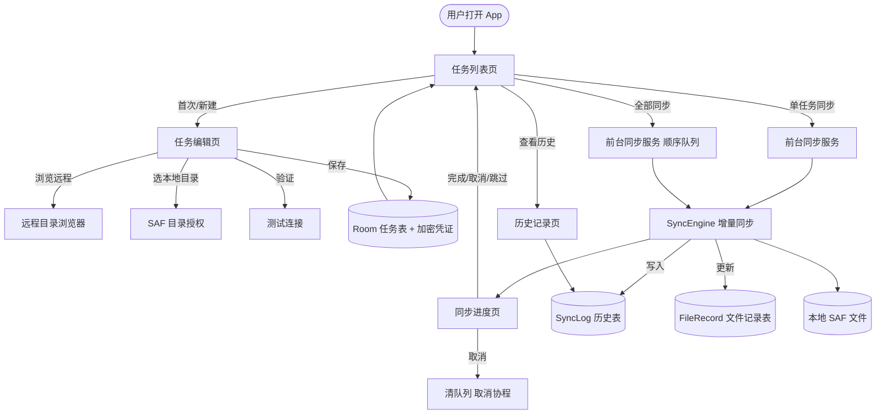

# 需求分析文档

> 项目名称：**轻量 WebDAV 同步下载工具（Android）**
> 文档版本：v1.0 · 最后更新：2026-08-05
> 依据：本文档内容完全基于 `app/src/main/` 实际代码与 `app/build.gradle.kts`、`AndroidManifest.xml` 推导得出。`✅` 表示已实现，`📌` 表示待扩展需求。

---

## 1. 业务背景

### 1.1 背景

个人用户普遍拥有自建的 NAS、家庭服务器或第三方网盘（如天翼云盘经 [AList](https://alist.nn.ci/) 暴露的 WebDAV 接口），其中存放大量照片、文档、备份资料。Android 设备（尤其是搭载**电子墨水屏**的阅读器/平板）需要一个轻量、稳定、省电的方式，把这些远程内容**增量下载到本地**，以便离线阅读或归档。

通用云盘客户端通常存在以下问题：

- 体积大、依赖重，在墨水屏等低性能设备上卡顿；
- 强制双向同步，容易反向覆盖或删除本地/远端数据；
- 不开放 WebDAV 这类标准协议接入；
- 缺乏"只增不删、可暂停、可续传"的最小化同步能力。

本项目定位为**最小化、单向、可断点续传的 WebDAV → 本地 目录同步下载器**：用户配置好若干"远程目录 → 本地目录"的任务后，即可一键增量拉取，全程前台服务保障，切后台与锁屏不中断。

### 1.2 项目范围

| 维度 | 说明 |
|------|------|
| 平台 | Android（`minSdk = 29` / `targetSdk = compileSdk = 35`） |
| 形态 | 原生 App，单模块 `:app`，无后端服务 |
| 协议 | 标准 WebDAV（RFC 4918）PROPFIND + GET，Basic 认证 |
| 方向 | **单向下载**（远程 → 本地），不支持上传/双向同步 |
| UI 框架 | Jetpack Compose + Material 3，电子墨水屏灰阶主题 |
| 最小依赖 | 不引入第三方 WebDAV 库，自研 OkHttp 客户端 |

---

## 2. 核心痛点

以下痛点均来自 `.zcode/plans/` 中的需求确认记录与代码实现所解决的实际问题：

| # | 痛点 | 现状影响 | 本工具的解决方式 | 状态 |
|---|------|----------|------------------|------|
| P1 | 通用云盘客户端庞大、在墨水屏/低配设备上耗资源 | 安装包大、内存占用高、卡顿 | 单模块原生 App，依赖精简（仅 OkHttp/Room/Compose/Security-Crypto/DocumentFile），无广告无后台常驻 | ✅ |
| P2 | 双向同步会误删/覆盖本地文件 | 重要本地文件被远端删除联动清除 | 默认**只增不删**，永不删除本地文件；`overwrite` 开关默认关闭 | ✅ |
| P3 | 全量下载重复传输，费流量费时间 | 每次同步重下全部文件 | 基于 **ETag（优先）/ size + lastModified（兜底）** 的增量比对，已同步文件跳过 | ✅ |
| P4 | 大文件下载中断后需从头再来 | 大文件反复重传、易 OOM | GET **流式写入** SAF OutputStream，规避 OOM；WebDavClient 已预留 `Range` 断点续传头支持 | ✅（流式）/ 📌（断点续传未在 SyncEngine 接通） |
| P5 | App 切后台/锁屏后系统杀进程，同步中断 | 长任务被迫中止 | **前台服务**（`foregroundServiceType=dataSync`）+ 通知，系统保活 | ✅ |
| P6 | 凭证明文存储，设备 root 后易泄露 | 账号密码裸露 | 密码单独使用 **EncryptedSharedPreferences（AES-GCM 256 + AES-SIV）** 加密存储，用户名/配置入 Room | ✅ |
| P7 | 内网自签名 HTTPS 服务器连接失败 | 私有 NAS 无法使用 | 任务级 `trustAllCerts` 开关，可选信任全部证书（含安全提示） | ✅ |
| P8 | 任务参数（服务器/路径/账号）填写易错 | 保存后才发现配置错误 | 任务编辑页内置**测试连接**与**远程目录浏览器** | ✅ |
| P9 | 不清楚某次同步成功/失败原因 | 只看到"已完成"无法回溯 | 每次同步写入 **SyncLog**，提供历史记录页（最近 20 条，全局保留 500 条） | ✅ |
| P10 | 无网/移动网络下误同步消耗流量 | 后台偷跑流量 | 同步前网络预检：`wifiOnly` 任务在非 Wi-Fi 跳过；无网直接失败提示 | ✅ |
| P11 | 多个远程目录需分别同步，重复操作 | 手动一个个触发 | 多任务管理 + **"全部同步"**（按顺序执行全部已启用任务） | ✅ |

---

## 3. 用户角色与场景

### 3.1 用户角色

本项目为个人/小范围使用的工具型 App，用户角色单一：

| 角色 | 描述 | 关键诉求 |
|------|------|----------|
| **终端用户（设备所有者）** | 拥有一台或多台 Android 设备（含墨水屏阅读器）和可访问的 WebDAV 服务器（NAS / AList / 自建）的普通用户 | 配置简单、同步稳定、不丢本地文件、省电省流量、可离线查看 |

> 说明：项目无管理员、多租户、协作等角色需求；不区分付费/免费用户。

### 3.2 核心使用场景

以下场景均可在代码中找到对应实现路径（见各文件链接）。

#### 场景 1：首次配置同步任务 ✅

```text
用户打开 App → 任务列表为空（EmptyState 引导）
→ 点击「新建任务」(TaskListScreen 的 FAB)
→ 填写任务名、服务器地址、用户名/密码 (TaskEditScreen)
→ 点「浏览」打开远程目录浏览器 (RemoteFolderPicker)，逐层选择远程目录
→ 点「选择目录」通过 SAF (OpenDocumentTree) 选定本地目录
→ （可选）开关：覆盖更新 / 仅 Wi-Fi / 信任证书 / 启用任务
→ 点「测试连接」验证服务器可达与认证 (TaskViewModel.testConnection)
→ 点「创建任务」保存 (TaskViewModel.saveTask → SyncTaskDao.insert + CredentialStore.savePassword)
```

#### 场景 2：手动同步单个任务 ✅

```text
任务列表 → 任务卡片点「同步」(onSync)
→ 启动 SyncService 前台服务 (SyncService.start)
→ 跳转同步进度页 (SyncProgressScreen)
→ 观察进度：获取清单 → 比对 → 下载（文件数/字节进度条）
→ 完成后停留 1.5s 自动返回列表，任务卡片更新「上次同步」与结果摘要
```

#### 场景 3：一键同步全部已启用任务 ✅

```text
任务列表顶栏 → 点「全部同步」(onSyncAll)
→ SyncService.startAll(taskIds) 入队，drainQueue 顺序执行
→ 进度页展示当前任务；单个失败不影响后续
→ 全部结束后自动清理过期日志 (logDao.trim(500)) 并 stopSelf
```

#### 场景 4：同步进行中切后台/锁屏 ✅

```text
同步中按 Home / 锁屏 → 前台服务保持运行 (FOREGROUND_SERVICE_DATA_SYNC)
→ 通知栏显示进度 (buildNotification)，可点「取消」中止
→ 取消 → pending 队列清空 + syncJob.cancel()，当前任务日志标记 CANCELLED
```

#### 场景 5：增量同步（只下载新增/变更）✅

```text
第二次同步同一任务 → SyncEngine 读 Room FileRecord
→ 对每个远程文件比对 etag（优先）/ size+lastModified
→ etag 一致 → SKIP；etag 变化且 overwrite=true → UPDATE；否则 → REMOTE_CHANGED
→ 仅下载 DOWNLOAD/UPDATE 集合，写回 FileRecord
```

#### 场景 6：排查同步失败原因 ✅

```text
任务卡片点「历史」(onOpenHistory) → TaskHistoryScreen
→ 查看最近 20 条 SyncLog（时间、状态符号✓/✗/–、下载/跳过/失败数、摘要消息）
→ 进度页「失败详情」列表展示逐文件错误
```

#### 场景 7：内网自签名 HTTPS 服务器 ✅

```text
任务编辑页打开「信任所有证书」(trustAllCerts)
→ WebDavClient 安装 TrustAll TrustManager + HostnameVerifier
→ 测试连接 / 同步时可连通内网服务器（UI 有安全风险提示）
```

#### 场景 8：仅 Wi-Fi 下同步 ✅

```text
任务开启 wifiOnly → SyncEngine.sync 前置检查 NetworkChecker.isOnWifi()
→ 非 Wi-Fi/以太网 → phase=SKIPPED，提示"任务设置为仅 Wi-Fi 同步,当前非 Wi-Fi 网络"
→ 已入队但跳过，不消耗流量
```

### 3.3 使用流程总览



---

## 4. 功能性需求清单

> 详细的接口/字段定义见 [`features.md`](./features.md)，技术架构见 [`design.md`](./design.md)。

### 4.1 任务管理

| 编号 | 需求 | 优先级 | 状态 |
|------|------|--------|------|
| FR-1.1 | 新建同步任务（名称、服务器、账号、远程路径、本地目录、选项开关） | 高 | ✅ |
| FR-1.2 | 编辑已有任务（密码留空表示不修改） | 高 | ✅ |
| FR-1.3 | 删除任务（级联清理 FileRecord / SyncLog / 加密凭证 / 释放 SAF 权限，**不删本地文件**） | 高 | ✅ |
| FR-1.4 | 启用/停用任务（停用后不参与"全部同步"，列表灰色显示） | 中 | ✅ |
| FR-1.5 | 任务列表实时刷新（Room Flow 订阅） | 高 | ✅ |
| FR-1.6 | 任务级选项：覆盖更新 `overwrite` / 仅 Wi-Fi `wifiOnly` / 信任证书 `trustAllCerts` / 启用 `enabled` | 高 | ✅ |
| FR-1.7 | 任务参数校验（名称、服务器地址、本地目录非空才允许保存） | 中 | ✅ |

### 4.2 WebDAV 连接与浏览

| 编号 | 需求 | 优先级 | 状态 |
|------|------|--------|------|
| FR-2.1 | 标准 WebDAV PROPFIND（Depth: infinity）拉取远程文件清单 | 高 | ✅ |
| FR-2.2 | 标准 WebDAV GET 流式下载 | 高 | ✅ |
| FR-2.3 | HTTP Basic 认证 | 高 | ✅ |
| FR-2.4 | 测试连接（PROPFIND Depth:0 探测根/指定路径） | 中 | ✅ |
| FR-2.5 | 远程目录浏览器（PROPFIND Depth:1 逐层浏览选目录） | 中 | ✅ |
| FR-2.6 | 兼容多 propstat 响应（按 RFC 4918 只采纳 200 OK 的属性，兼容 AList） | 高 | ✅ |
| FR-2.7 | 中文/编码路径自动 URL decode 与 percent-encode | 高 | ✅ |
| FR-2.8 | 断点续传（GET Range 头） | 中 | 📌（WebDavClient 已支持 Range 参数，SyncEngine 未接通） |
| FR-2.9 | 上传 / 双向同步 / 远程删除 | 低 | 📌（不在本项目范围内，单向下载） |

### 4.3 同步引擎

| 编号 | 需求 | 优先级 | 状态 |
|------|------|--------|------|
| FR-3.1 | 增量下载：ETag 优先，无 ETag 用 size + lastModified 兜底 | 高 | ✅ |
| FR-3.2 | 只增不删：默认不覆盖、不删除本地文件 | 高 | ✅ |
| FR-3.3 | 覆盖更新：任务开启 `overwrite` 时，远程变更文件覆盖本地 | 中 | ✅ |
| FR-3.4 | 远程已变更但未更新：`overwrite=false` 时标记 REMOTE_CHANGED 并跳过 | 中 | ✅ |
| FR-3.5 | 本地已有文件但无记录：跳过（尊重本地文件，不覆盖） | 中 | ✅ |
| FR-3.6 | 部分文件失败不中断整体：失败计入 failed，继续后续文件 | 高 | ✅ |
| FR-3.7 | 取消同步：协程取消，pending 队列清空 | 高 | ✅ |
| FR-3.8 | SAF 权限失效前置校验 | 高 | ✅ |
| FR-3.9 | 网络前置校验（在线 / Wi-Fi） | 高 | ✅ |

### 4.4 前台服务与通知

| 编号 | 需求 | 优先级 | 状态 |
|------|------|--------|------|
| FR-4.1 | 前台服务 `dataSync` 类型，切后台/锁屏不中断 | 高 | ✅ |
| FR-4.2 | 通知栏进度（阶段文案、文件数/字节进度条、当前文件名） | 高 | ✅ |
| FR-4.3 | 通知「取消」操作按钮 | 中 | ✅ |
| FR-4.4 | 通知渠道 `IMPORTANCE_LOW`，不打扰 | 中 | ✅ |
| FR-4.5 | Android 13+ 运行时申请 `POST_NOTIFICATIONS` | 中 | ✅ |
| FR-4.6 | 多任务顺序队列（drainQueue） | 中 | ✅ |

### 4.5 数据与凭证安全

| 编号 | 需求 | 优先级 | 状态 |
|------|------|--------|------|
| FR-5.1 | 密码加密存储（EncryptedSharedPreferences AES256-GCM + AES256-SIV） | 高 | ✅ |
| FR-5.2 | 用户名与配置入 Room（明文，非敏感） | 中 | ✅ |
| FR-5.3 | 任务删除时清除对应加密凭证 | 高 | ✅ |
| FR-5.4 | SAF 持久化 URI 权限（`takePersistableUriPermission`） | 高 | ✅ |
| FR-5.5 | 任务删除时释放 SAF 权限 | 中 | ✅ |

### 4.6 UI / 体验

| 编号 | 需求 | 优先级 | 状态 |
|------|------|--------|------|
| FR-6.1 | 电子墨水屏灰阶主题（纯灰阶、强制浅色、描边代阴影） | 高 | ✅ |
| FR-6.2 | 状态语义不依赖颜色（符号 ✓/✗/– + 文字双重标识） | 高 | ✅ |
| FR-6.3 | 任务列表 / 编辑 / 进度 / 历史 四个核心页面 | 高 | ✅ |
| FR-6.4 | 进度页展示：阶段、进度条、文件数/字节、当前文件、统计、失败详情 | 高 | ✅ |
| FR-6.5 | 完成后停留 1.5s 自动返回列表 | 低 | ✅ |
| FR-6.6 | 删除任务二次确认对话框 | 中 | ✅ |
| FR-6.7 | 空状态引导（无任务时） | 低 | ✅ |

### 4.7 历史与可观测

| 编号 | 需求 | 优先级 | 状态 |
|------|------|--------|------|
| FR-7.1 | 每次同步写入 SyncLog（开始/结束时间、阶段、各类计数、字节数、消息） | 高 | ✅ |
| FR-7.2 | 历史页展示某任务最近 20 条 | 中 | ✅ |
| FR-7.3 | 全局日志保留 500 条，定期清理 | 低 | ✅ |

---

## 5. 非功能性需求

| 类别 | 需求 | 状态 | 实现依据 |
|------|------|------|----------|
| 性能 | 大文件流式下载，避免 OOM | ✅ | `WebDavClient.download` → `input.copyTo(output)` 流式 |
| 性能 | 网络超时：连接 15s / 读写 60s | ✅ | `WebDavClient.buildClient` |
| 可靠性 | 部分失败不回滚，失败文件下次续传 | ✅ | `SyncEngine.sync` 失败 try/catch 计入 failed |
| 可靠性 | Room 数据库迁移（v1→v2） | ✅ | `AppDatabase.MIGRATION_1_2` |
| 安全 | 凭证加密存储 | ✅ | `CredentialStore` |
| 安全 | 默认不信任全部证书 | ✅ | `trustAllCerts` 默认 false |
| 兼容性 | Android 10（API 29）及以上 | ✅ | `minSdk = 29` |
| 兼容性 | 适配 Android 14 前台服务类型声明 | ✅ | `FOREGROUND_SERVICE_DATA_SYNC` |
| 隐私 | 仅本地存储，无云上报 | ✅ | 全程无网络上报代码 |
| 可维护性 | 单元测试覆盖 PROPFIND 解析 | ✅ | `PropfindParserTest` |
| 可维护性 | 端到端联调测试（真实服务器，不可达自动跳过） | ✅ | `WebDavClientE2ETest` / `DeviceSyncE2ETest` |
| 电量 | 仅手动触发，无后台轮询/定时任务 | ✅ | 无 WorkManager / 定时器 |
| 体积 | 不引入第三方 WebDAV 库 | ✅ | 自研 `WebDavClient` |
| 国际化 | UI 文案为中文，未做 i18n | 📌 | `strings.xml` 仅含 app_name |
| 无障碍 | Compose 默认 contentDescription 已加，未做完整无障碍审计 | 📌 | `[待确认]` |

---

## 6. 约束与假设

### 6.1 约束

- 仅支持 **WebDAV** 协议（RFC 4918），不支持 FTP / SFTP / S3 等其他协议。
- 同步方向为**单向下载**（远程 → 本地），不支持上传与双向同步。
- 触发方式为**手动**，当前不支持定时同步、开机自启同步（`RECEIVE_BOOT_COMPLETED` 权限已声明但未实现接收器，留作扩展）。
- 本地目录写入依赖 **SAF（Storage Access Framework）**，不直接操作文件系统路径。
- 不支持多用户/账号隔离，所有任务共享同一 App 数据空间。

### 6.2 假设

- WebDAV 服务器正确实现 PROPFIND 与 GET，并返回 `getetag` / `getcontentlength` / `getlastmodified` 属性。
- ETag 稳定的服务器（如 AList）增量效果最佳；无 ETag 的服务器退化为 size + lastModified 判定，可能存在误判。
- 用户授权的 SAF 目录可读写且不会被系统在任务存活期间回收（已通过 `takePersistableUriPermission` 持久化）。
- 设备支持 `dataSync` 前台服务类型（Android 10+）。

### 6.3 待确认事项

| 编号 | 事项 | 说明 |
|------|------|------|
| `[待确认]` | 断点续传是否纳入正式需求 | `WebDavClient.download(fromByte)` 已支持 Range，但 `SyncEngine.downloadOne` 固定 `fromByte=0L`，未接通续传逻辑。 |
| `[待确认]` | 定时同步 / 开机自启 | 权限 `RECEIVE_BOOT_COMPLETED` 已声明，无对应 BroadcastReceiver 实现。 |
| `[待确认]` | 国际化（i18n） | 当前 UI 文案硬编码中文。 |
| `[待确认]` | 完整无障碍审计 | Compose contentDescription 已部分添加。 |

---

## 7. 术语表

| 术语 | 含义 |
|------|------|
| **WebDAV** | Web Distributed Authoring and Versioning，RFC 4918 标准的 HTTP 扩展协议，用于远程文件管理。 |
| **PROPFIND** | WebDAV 方法，用于查询资源属性（ETag、大小、修改时间、是否目录等）。`Depth: infinity` 递归，`Depth: 1` 单层，`Depth: 0` 自身。 |
| **ETag** | 实体标签，文件内容的唯一标识，相同即认为文件未变更。 |
| **SAF** | Android Storage Access Framework，通过 `ACTION_OPEN_DOCUMENT_TREE` 让用户授权目录访问。 |
| **SAF treeUri** | SAF 授权目录的 URI，需 `takePersistableUriPermission` 持久化以跨重启访问。 |
| **前台服务（Foreground Service）** | 带通知的 Android Service，系统给予更高保活优先级，`dataSync` 类型用于数据同步场景。 |
| **增量同步** | 仅传输新增/变更文件，已同步且未变的文件跳过。 |
| **只增不删** | 同步策略：只下载新文件，从不删除/覆盖本地已有文件（除非任务显式开启 `overwrite`）。 |
| **AList** | 一款开源的网盘聚合工具，可将多家网盘以 WebDAV 协议暴露，本项目的主要兼容目标之一。 |
| **墨水屏 / E-Ink** | 电子纸显示技术，反射式、灰阶、刷新慢，需要专门的灰阶 UI 设计。 |
